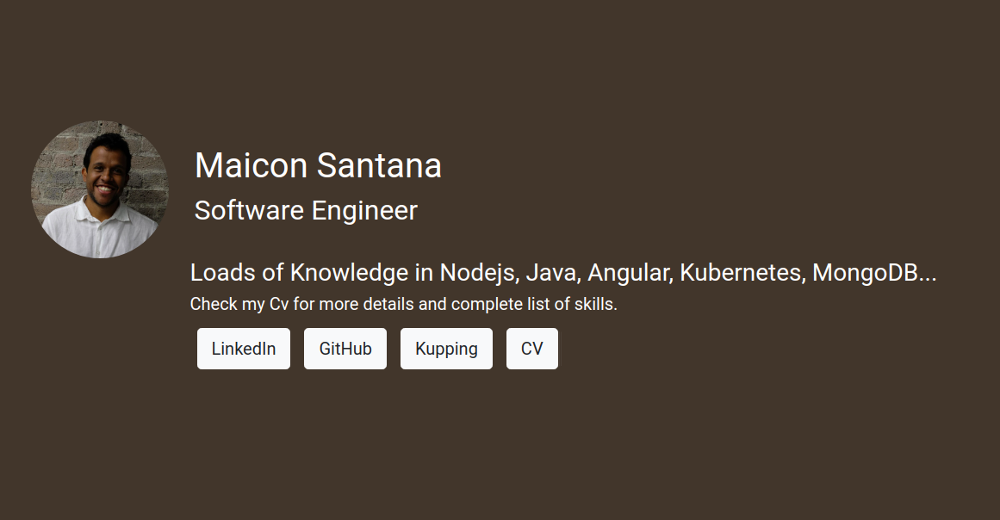

# [Personal Website](https://maicondev.com)
Website with my experiences and projects

## LinkedIn
[Here](https://www.linkedin.com/in/maicon-santana-88262571) you will find my experiences.
## GitHub
[Here](https://github.com/maiconpintoabreu) you will find my projects most of open source.
## Kupping (Open Source Project)
[Here](https://kupping.maicondev.com/) is the main project that I am current working on.
* [Backend Source](https://github.com/maiconpintoabreu/Kupping-Backend) 
* [Frontend Source](https://github.com/maiconpintoabreu/Kupping) 
* [Android Source](https://github.com/maiconpintoabreu/Kupping-Mobile) 
## CV
[Here](https://maicondev.com/asserts/CvMaicon.pdf) you will find my experiences in a PDF file.

## GPG - Secrets

gpg --symmetric --cipher-algo AES256 "FILENAME.*"